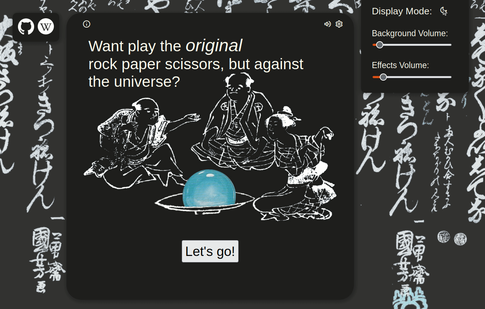
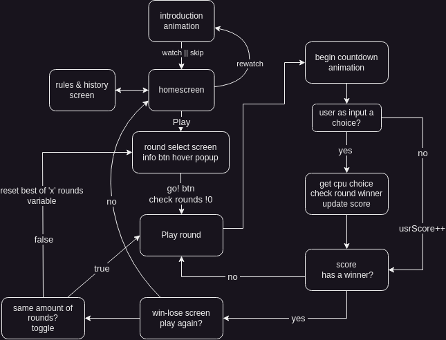

<div align="center"> 
<h1>Sansukumi-Ken, the <em>original</em> rps</h1>

<p><em>Game Demo on Dark Mode</em></p>
</div>

## Introduction

The first objective of this proyect is to allow the user to play a simple
Rock-Paper-Scissors game against a truly random generated choice; first only via a text, and later with a GUI.
This is possible thanks to [random.org](https://www.random.org/), who generate a random number output based on unpredictable micro atmosferic noise changes.

## Constrictions
- Cpu choices must only be initialized after the user already selected a weapon of choice
so no cheating its allowed prior. 
- Since the machine selects its own weapon on random, there is no problem on letting it select after.
- Draws should not count towards the scores but should be registered in the total rounds count.

## Implementations

- SPA design with no dead ends.

- CPU choice is set from random.org API using ```fetch()```, so no backend is needed. Done asynchronously using ```.then``` and ```await```.

- Ability to select the number of rounds to be played.

- Set color scheme dark/light based on user browser preference and toggable.

- background music is mixed array with independent random intervals, with a fixed parameter limit, givin a unique user experience each time.

- Round/Game adhoc sound effects depending if user win or lose.

- Volume is mutable and adjustable independently.

- GUI visualitation of the game, with animations to give 

- Misc: Round's selector slider outputs a random color on each value change event

<div align="center">

<p><em>Dark Mode toggle demo</em></p>
</div>

## Concept



## Ideas

- add more information on the history of rps and add visual key to relate each one to correspondent 'slug' 'frog' 'snake'. etc

- animation falling humans on humanity win


## Known Issues 

- In the end-screen, if the play again button 'yes' is click fast enough that the card animation is still not ended && 'same rounds' is checked,  it triggers the second part of the 'card going back animation'
- Monsters silluettes could be improved
- A little delay is needed between each round call for the random.org API to work

